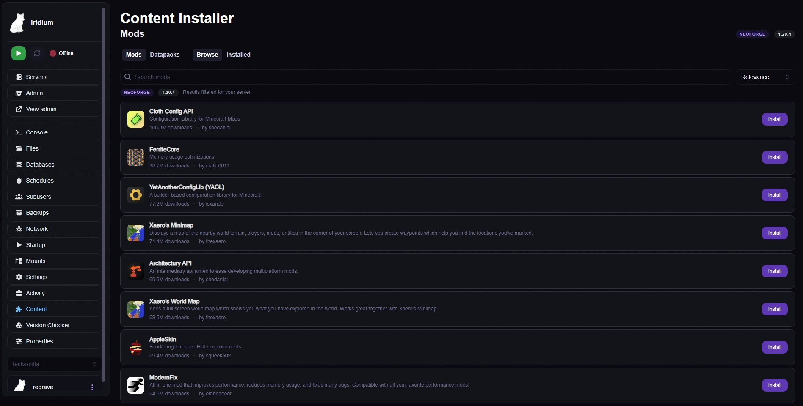
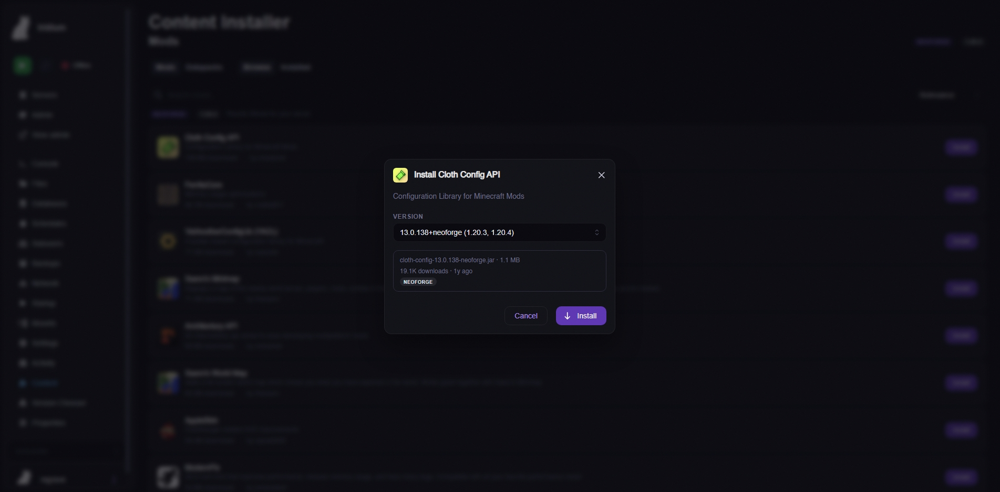

# Content Installer

A [Calagopus Panel](https://github.com/calagopus/panel) extension for browsing, installing, and managing Minecraft plugins, mods, and datapacks directly from the panel.

Currently powered by [Modrinth](https://modrinth.com). CurseForge support is planned once an API key is obtained.

## Screenshots

### Browse Mods
Search and browse content from Modrinth, automatically filtered for your server type and Minecraft version.



### Install Modal
Select a specific version, see file size and loader compatibility, and install with one click.



## Features

### Browse
- Search plugins, mods, and datapacks from the Modrinth API
- Results automatically filtered by server type (Paper, Fabric, Forge, NeoForge, etc.) and Minecraft version
- Sort by relevance, downloads, follows, newest, or recently updated
- Install modal with version selector, file size, loader tags, and download count
- Paginated results with load more

### Manage
- View all installed plugins/mods/datapacks with file sizes
- Remove installed content with confirmation dialog
- Separate views for plugins, mods, and datapacks

### Datapacks
- Full datapack support for all server types (including vanilla)
- World selector when multiple worlds exist (e.g. `world`, `world_nether`, `world_the_end`)
- Reads `level-name` from `server.properties` to find the correct world directory

### Server Detection
Automatically detects your server type and Minecraft version using a deterministic decision tree:

**Server type** (checked in order, most specific first):
1. `.mcvc-type.json` marker (from [MC Version Chooser](https://github.com/Regrave/mc-version-chooser) extension)
2. `purpur.yml` → Purpur
3. `pufferfish.yml` → Pufferfish
4. `leaves.yml` → Leaves
5. `config/folia-global.yml` → Folia
6. `config/paper-global.yml` → Paper
7. `spigot.yml` → Spigot
8. `bukkit.yml` → CraftBukkit
9. `.fabric/` or `fabric-server-launch.jar` → Fabric
10. `.quilt/` or `quilt-server-launcher.jar` → Quilt
11. `libraries/net/neoforged/` → NeoForge
12. `libraries/net/minecraftforge/` → Forge
13. `server.properties` (nothing else matched) → Vanilla

**Minecraft version** (checked in order):
1. `.mcvc-type.json` marker version
2. `version.json` in server root (vanilla + Bukkit-chain)
3. Forge/NeoForge library folder name (version encoded in path)
4. `logs/latest.log` — greps for `"Starting minecraft server version"`

**Content tabs shown based on detection:**
- Vanilla → Datapacks only
- Plugin servers (Paper, Spigot, Purpur, etc.) → Plugins + Datapacks
- Mod servers (Fabric, Forge, NeoForge, Quilt) → Mods + Datapacks
- Hybrid servers (Mohist, Arclight) → Plugins + Mods + Datapacks

## Architecture

```
├── Metadata.toml          # Extension metadata
├── backend/
│   └── src/lib.rs         # Rust backend - install/remove via Wings API
├── frontend/
│   └── src/
│       ├── index.ts       # Extension entry point + route registration
│       ├── detect.ts      # Server type + MC version detection
│       ├── modrinth.ts    # Modrinth API client
│       ├── ContentInstallerPage.tsx  # Main page with tab routing
│       ├── BrowseTab.tsx  # Search + install from Modrinth
│       ├── ManageTab.tsx  # View + remove installed content
│       └── app.css        # Styling
```

## Backend API Routes

- `POST /api/client/servers/{uuid}/content-installer/install` — Download a file to plugins/, mods/, or datapacks/
- `GET /api/client/servers/{uuid}/content-installer/install/status` — Check download progress
- `POST /api/client/servers/{uuid}/content-installer/remove` — Remove a file from plugins/, mods/, or datapacks/

All routes require `files.create` or `files.delete` permissions. Download URLs are validated against a whitelist of trusted CDN domains (Modrinth CDN, CurseForge CDN).

## Installation

1. Download the latest `.c7s.zip` from [Releases](https://github.com/Regrave/content-installer/releases)
2. Upload it to your panel's extensions directory
3. Trigger a panel rebuild
4. A "Content" tab will appear in each server's sidebar

## License

MIT
